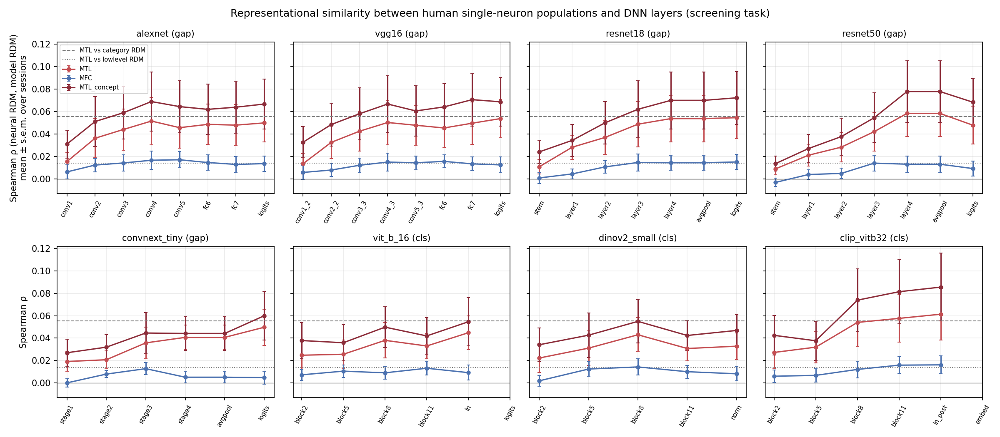
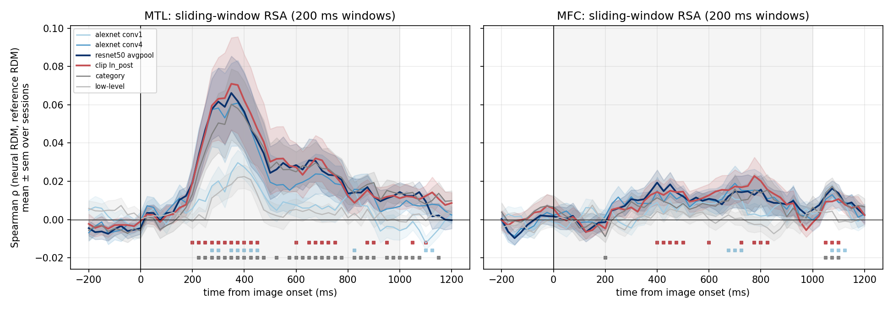
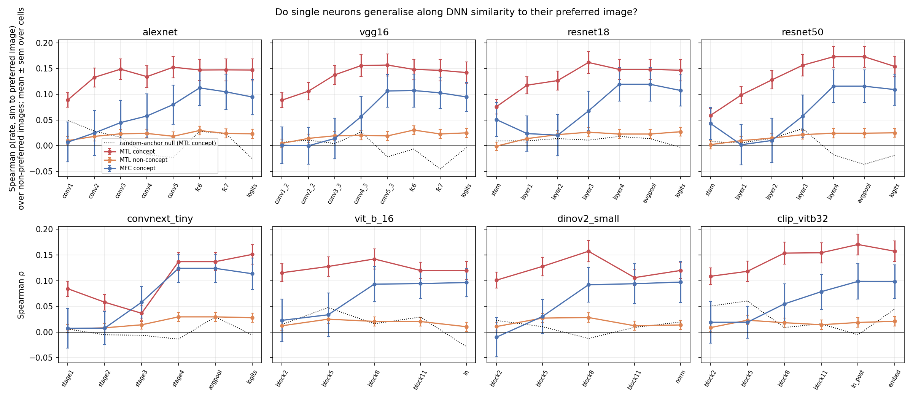

# memoranda

*memoranda* (n., pl.) — the things to be remembered. Here: the pictures that
epilepsy patients held in working memory while single neurons were recorded.

**What is it about these pictures that makes human concept cells fire?**

This project takes the images that were shown to epilepsy patients in the
Sternberg working-memory dataset of Kyzar et al. (2024, *Scientific Data*;
DANDI 000469) and asks a simple question: *what is it about these pictures
that makes single neurons in the human medial temporal lobe fire?*

The dataset provides 1809 single neurons (amygdala, hippocampus, dACC,
pre-SMA, vmPFC) recorded while 21 patients viewed 54–64 images in a screening
task and then held the 5 most "neuron-selective" of those images in working
memory (Kamiński et al. 2017, *Nature Neuroscience*). Every image is stored in
the NWB files. We pull them out, push them through a zoo of convolutional and
transformer vision models (AlexNet → ResNet → ConvNeXt, ViT, CLIP, DINOv2),
and relate the resulting representations back to the neural selectivity that
the original authors measured.

## Questions

1. **What kind of images were shown?** Category, semantic content, low-level
   statistics (luminance, contrast, spatial frequency, colorfulness) — for the
   whole screening set and for the 5-image Sternberg subsets.
2. **Are the "winning" Sternberg images special?** Do the images that drove
   concept cells sit somewhere particular in DNN feature space (e.g. faces,
   prototypical exemplars, high-salience, semantically distinct)?
3. **Which model layers look like the MTL?** Representational similarity
   analysis between neural population RDMs (per session, over the screening
   images) and layer-wise DNN RDMs.
4. **Can DNN features predict single-neuron responses?** Cross-validated
   encoding models from DNN embeddings to per-image firing rates.
5. **Does image similarity predict working-memory behaviour?** Semantic /
   perceptual confusability of the 5 memoranda vs. reaction time and accuracy
   on probe trials.

## Layout

```
memoranda/        python package (data access, models, analysis)
scripts/            CLI entry points, one per pipeline stage
configs/            YAML configs for models and analyses
tests/              pytest
data/manifests/     small, committed CSV/JSON manifests
results/            figures + tables (committed)
docs/               notes, methods, decisions
```

## Findings so far

Full numbers in [docs/results.md](docs/results.md); methods in [docs/methods.md](docs/methods.md).

**Replication.** All 1809 units, behaviour (88.7 % correct) and concept-cell fractions
(MTL 31.8 %, MFC 6.0 %) reproduce Kyzar et al.; MTL concept cells stay active during
WM maintenance when their image is held (p = 7e-9), MFC cells do not.

**The stimuli.** Only 342 unique pictures underlie the 41 files. CLIP zero-shot: 37 % faces /
people, 14 % animals, 11 % landmarks, 10 % vehicles, the rest objects, scenes, nature, food.
The only picture property that predicts whether an image became one of a patient's five
Sternberg memoranda is a detected face (62 % vs 49 %, AUC 0.57, q = 0.02); category, CLIP
attributes, low-level statistics and DNN-space typicality / isolation do not. Our replicated
neural selectivity does (AUC ≈ 0.7), and an image that "won" in other patients is not more
likely to win in this one (LOSO AUC 0.54). Being a concept-cell image is largely a
*patient × image* property.

**What concept cells like.** Bias toward pictures with a detected face (66 % vs 53 % shown,
p = 0.003; amygdala-driven) and famous people, against text/logos; per shown image, animals
(0.19 cells/patient) > faces (0.14) > vehicles > places > food > objects (0.01). Right amygdala
concept cells prefer animals 4× more often than left (21 % vs 5 %, p = 0.04) — Mormann et al.
2011 rediscovered — and right-amygdala concept cells generalise along DNN similarity far more
than left ones (ρ 0.30 vs 0.04). Across patients, cells preferring the *same* picture agree on the rest no
better than cells preferring different pictures of the same category: what transfers between
people is category structure, not picture-specific tuning.

**Neural ↔ DNN geometry (RSA).** MTL population RDMs correlate with every model's late
layers (ρ ≈ 0.06 per session, 0.13 pooled across patients; ceiling-normalised ≈ 0.25),
rising monotonically with depth; MFC ≈ 0.015; amygdala ≫ hippocampus. Late layers explain
MTL geometry beyond category and low-level structure and subsume the category RDM. The
correspondence emerges ~200 ms after onset and peaks at 350 ms.

**Single neurons generalise along DNN similarity.** A concept cell's response to the other
54–62 images correlates with their late-layer similarity to its preferred image
(mean ρ ≈ 0.17, 77 % of cells positive; null ≈ 0), increasing with layer depth, emerging at
~225 ms and peaking at 325 ms. Face-preferring cells generalise across other faces along
object-model similarity more than along VGGFace2 identity similarity. Architecture and training
objective barely matter — a CLIP-trained ResNet-50 and the ImageNet ResNet-50 are
indistinguishable layer by layer; CLIP's ViT alone keeps a within-category correspondence
with the MTL.

|  |
|:--:|
| *MTL–model similarity climbs with layer depth in every architecture; MFC stays flat.* |

|  |  |
|:--:|:--:|
| *Sliding-window RSA* | *Per-neuron generalisation along DNN similarity* |

## Data

DANDI 000469 — https://dandiarchive.org/dandiset/000469 (9.8 GB, 41 NWB files).
We do **not** download the archive; NWB groups are streamed over HTTP with
`remfile` + `h5py`, and only images / trials / spike times are cached locally.

## References

- Kyzar M, Kamiński J, Brzezicka A, Reed CM, Chung JM, Mamelak AN, Rutishauser U.
  *Dataset of human single-neuron activity during a Sternberg working memory task.*
  Sci Data 11:89 (2024). https://doi.org/10.1038/s41597-024-02943-8
- Kamiński J, Sullivan S, Chung JM, Ross IB, Mamelak AN, Rutishauser U.
  *Persistently active neurons in human medial frontal and medial temporal lobe
  support working memory.* Nat Neurosci 20:590–601 (2017).
  https://doi.org/10.1038/nn.4509
